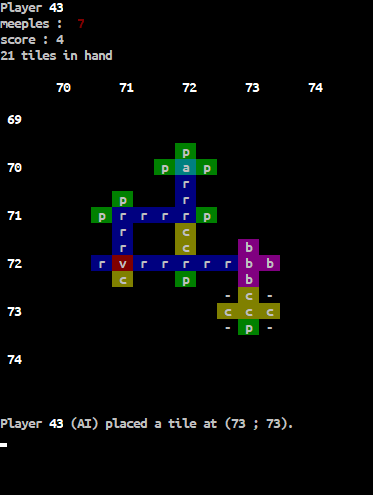

# Carcassonne
In this repository, I developed the french board game Carcassonne in C for a school project, with an AI explained below.

## What is Carcassonne?
Carcassonne is a game where players play tiles on a board to build cities, roads and other structures. The goal is to place pawns named "meeples" on those structures to earn points, and to build structures completly to earn more points.

## How the AI works
The AI uses a fonction that counts the points a move could make, saves every move it could make and then chooses which move to play, depending on its difficulty. It's pretty simple, but it works surprisingly well! 

## How to run
While in the `carcassonne-game` folder, run `make` to compile the program, and then execute the `main` file to play on terminal. Add the `clear`option to clear the terminal beforehand.

## How to play

When you draw a tile you can rotate it and play it, if it is possible. You can also switch the board type to see which tiles have meeples on them, and you can see the current ranking.

After placing the tile, you can place a meeple on a side of the tile.

If you choose to place a meeple, the board type switches to show the meeples, and help you pick a side. 

If you chose to play with AI(s), their ID will be higher than 42 to help recognize them.  

At any time in the game you can press **Q** to quit. When you do so, it will show the ranking and exit the program. 
